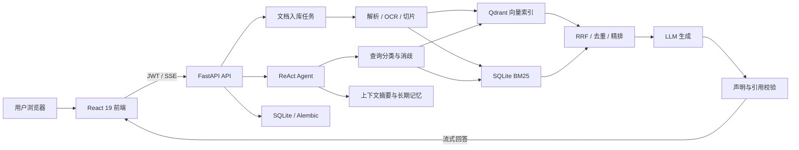

# RAG Agent：本地知识库智能助手

> 一个强调检索质量、证据引用、回答校验、任务恢复和本地数据边界的开源 RAG Agent。


RAG Agent 是一个本地优先的文档知识库与智能问答系统。用户上传文档后，可以直接使用自然语言提问；系统会完成意图识别、查询消歧、混合检索、工具调用、证据组织、流式回答和引用校验。

它不仅是“上传文档后调用一次大模型”，而是一套覆盖文档入库、检索、生成、校验、持久化、恢复、认证和评测的完整工程链路。

当前阶段：`v0.1.0-beta` 开源候选。

## 目录

- [项目亮点](#项目亮点)
- [适用场景](#适用场景)
- [核心功能](#核心功能)
- [系统架构](#系统架构)
- [文档入库流程](#文档入库流程)
- [问答与检索流程](#问答与检索流程)
- [支持的文件格式与限制](#支持的文件格式与限制)
- [快速开始](#快速开始)
- [账号、登录与密码](#账号登录与密码)
- [配置说明](#配置说明)
- [使用指南](#使用指南)
- [质量评测](#质量评测)
- [自动化测试](#自动化测试)
- [安全与隐私](#安全与隐私)
- [可靠性设计](#可靠性设计)
- [常见问题](#常见问题)
- [项目文档](#项目文档)
- [参与贡献](#参与贡献)
- [许可证](#许可证)

## 项目亮点

### 可量化的回答质量

当前正式在线评测包含 93 条问答：

| 指标 | 结果 |
|---|---:|
| 回答忠实度 | **98.48%** |
| 引用精确率 | **98.48%** |
| 引用召回率 | **98.48%** |
| 拒答准确率 | **100.00%** |
| 回答完成度 | **98.92%** |
| 预期事实召回 | **87.47%** |
| 首 Token 延迟 P95 | **945.39 ms** |
| 总延迟 P95 | **2,109.26 ms** |
| 评测运行错误 | **0** |

质量门禁和性能门禁均通过，且没有门禁违规项。

### 面向复杂查询的混合检索

系统并行执行两条检索路径：

| 检索路径 | 引擎 | 主要优势 |
|---|---|---|
| 语义检索 | Qdrant | 自然语言、同义表达、上下文相关问题 |
| 关键词检索 | SQLite BM25 | 错误码、SKU、型号、专有名词和精确字段 |

两路结果经过加权 RRF 融合、查询消歧、内容去重、质量过滤和可选 Cross-Encoder 精排，再作为证据发送给大模型。

严格 qrels 检索评测结果：

| 指标 | Top-3 | Top-5 | Top-10 |
|---|---:|---:|---:|
| Recall | **88.65%** | **92.96%** | **99.57%** |
| Hit Rate | **100.00%** | **100.00%** | **100.00%** |
| NDCG | **92.80%** | **93.17%** | **95.13%** |

MRR 为 **97.70%**。

### 基于证据的回答校验

回答生成后并不会直接结束。系统会进一步检查：

- 引用是否真实存在；
- 引用位置是否正确；
- 引用是否能够支持对应声明；
- 声明中的数字是否与证据一致；
- 是否遗漏必须引用的事实；
- 没有充分证据时是否应当拒答；
- 是否需要确定性修复或有界 LLM 修复。

这套机制可以减少“回答看起来合理，但证据并不支持”的情况。

### 可恢复的文档处理

文档处理不是一次性后台协程，而是带持久状态的任务：

- 保存任务类型、参数、执行次数和心跳；
- 异常后进入重试等待；
- 超过最大次数进入死信状态；
- 服务重启后恢复未完成任务；
- OCR 尚未就绪时进入明确等待状态；
- 删除、恢复和重建同时维护文件、SQLite、Qdrant 与 BM25 一致性。

### 本地优先与安全认证

- 上传文件、SQLite、Qdrant、BM25 和模型缓存默认保存在本地；
- 业务 API 使用 JWT Bearer 鉴权；
- Refresh Token 只保存在 `HttpOnly + SameSite=Lax` Cookie；
- 前端 JavaScript 无法读取 Refresh Token；
- 修改密码后旧 Refresh Token 自动失效；
- 支持基础角色和系统管理员权限检查；
- 默认只监听 `127.0.0.1`。

## 适用场景

- 企业制度、操作手册、产品资料和技术文档问答；
- 项目资料、研究报告和会议纪要检索；
- 错误码、接口字段、型号和配置项精确查询；
- 多文档对比、内容总结和关键事实抽取；
- 需要显示来源和引用位置的专业问答；
- 对文档本地保存、权限控制和结果可追溯有要求的知识库；
- 希望研究 RAG、Agent、混合检索和引用校验实现的开发者。

## 核心功能

### 知识库

- 单文件与批量上传；
- 流式写入磁盘，避免大文件一次性进入内存；
- SHA-256 内容重复检测；
- 文档解析、切片、Embedding 和索引；
- 实时显示上传与处理进度；
- 文档删除、重新处理和集合重建；
- Qdrant 与 BM25 双索引；
- 文档状态持久化；
- 服务端文件数量和容量限制；
- 备份与恢复。

### 检索

- Qdrant 语义检索；
- SQLite BM25 关键词检索；
- 中文分词及精确代码保留；
- 查询类型分类；
- 错误码、数字、货币、时间和实体消歧；
- 可选查询改写；
- 加权 Reciprocal Rank Fusion；
- 跨文档重复内容过滤；
- Chunk 质量预过滤；
- 可选 Cross-Encoder Reranker；
- 单路检索故障降级。

### Agent

- 自研 ReAct 工具循环；
- 规则优先、LLM 兜底的意图判断；
- 多工具并行调用；
- 参数校验与结构化错误；
- 工具级超时与重试策略；
- 客户端断连取消；
- 循环次数与总耗时限制；
- 上下文溢出渐进恢复；
- 工具结果压缩和不可信内容隔离。

内置工具包括：

| 工具 | 用途 |
|---|---|
| `search_docs` | 检索本地知识库 |
| `web_search` | 可选联网检索 |
| `calculator` | 基于白名单语法的数学计算 |
| `list_documents` | 查看知识库文档 |
| `get_document_info` | 获取单个文档信息 |
| `recall_memory` | 读取用户长期记忆 |

### 回答与前端

- SSE 流式输出；
- 工具调用过程卡片；
- 来源列表与引用展示；
- Markdown 与表格渲染；
- 引用精确率、引用完整度与事实覆盖检查；
- 对无证据问题选择性拒答；
- 对话创建、切换、重命名和删除；
- 文档管理页面；
- 设置页面；
- 记忆管理页面；
- 登录、可选修改密码和退出登录。

### 长上下文与记忆

- Tokenizer 感知的上下文预算；
- 系统提示、工具定义、历史消息和输出预留统一计费；
- 工具调用和工具结果原子裁剪；
- 被裁剪历史的有界摘要；
- 摘要指纹、水位和并发保护；
- 用户偏好、决定、身份和项目事实提取；
- 精确匹配、向量相似度和字符串相似度三级去重；
- 访问频率与最近时间加权保留。

### 运维与可观测性

- 核心健康检查；
- LLM、Embedding、Qdrant、OCR 和 Reranker 依赖状态；
- Prometheus 格式指标；
- 结构化日志；
- 审计日志；
- 后台任务状态；
- 数据库迁移和迁移前快照；
- 发布质量门禁；
- Docker E2E 验收脚本。

## 系统架构



主要目录：

```text
RAG-ReActAgent/
├── main.py                         统一启动后端和前端
├── backend/
│   ├── main.py                     FastAPI 应用与生命周期
│   ├── api/                        文档、聊天、会话、用户、备份等接口
│   ├── agent/                      Agent 循环、上下文、工具和回答校验
│   ├── rag/                        加载、切片、查询分类、检索与消歧
│   ├── embedding/                  Embedding 抽象
│   ├── llm/                        LLM 抽象
│   ├── textdb/                     SQLite BM25
│   ├── vectordb/                   Qdrant
│   ├── reranker/                   可选 Cross-Encoder 精排
│   ├── ocr/                        可选 OCR
│   ├── memory/                     长期记忆与用户画像
│   ├── worker/                     持久后台任务
│   ├── alembic/                    数据库迁移
│   ├── tests/                      单元、集成、质量和发布门禁测试
│   └── tools/                      可选模型下载等工具
├── frontend/
│   ├── src/api/                    API 与 SSE 客户端
│   ├── src/components/             页面和组件
│   ├── src/stores/                 Zustand 状态
│   └── e2e/                        Playwright 场景
├── scripts/                        Docker 验收与性能基准
└── docs/                           对外项目文档
```

## 文档入库流程

```text
上传文件
  → 检查扩展名、数量和容量
  → 流式写入临时对象
  → 计算 SHA-256 并检查重复
  → 创建文档记录和持久任务
  → 解析正文
  → 必要时执行 OCR
  → 按段落、标题和表格边界切片
  → 批量生成 Embedding
  → 写入 Qdrant
  → 写入 SQLite BM25
  → 更新文档状态
  → 前端收到完成进度
```

切片默认使用 200 Token 大小和 40 Token 重叠。系统优先在段落、Markdown 标题和句号附近切分，并尽量避免破坏表格。

## 问答与检索流程

```text
用户问题
  → 规则意图判断
  → 必要时使用 LLM 兜底分类
  → 解析实体、代码、数字和约束
  → 可选查询改写
  → 并行语义检索与关键词检索
  → RRF 融合
  → 消歧、去重和质量过滤
  → 可选 Reranker
  → 形成 Top-K 证据
  → Agent 调用工具并生成回答
  → 引用和事实校验
  → SSE 流式返回
  → 保存消息、来源和校验结果
```

若语义检索或关键词检索单独失败，系统会保留另一条路径的结果；两条路径都不可用时才返回明确的检索错误。

## 支持的文件格式与限制

当前上传 API 支持：

| 格式 | 扩展名 |
|---|---|
| PDF | `.pdf` |
| Word | `.docx` |
| 文本 | `.txt` |
| Markdown | `.md` |
| CSV | `.csv` |
| Excel | `.xlsx` |

默认限制：

| 项目 | 默认值 | 可配置范围 |
|---|---:|---:|
| 单文件大小 | 200 MB | 1–512 MB |
| 单批文件数量 | 50 | 2–200 |
| 单批总容量 | 1024 MB | 1–10240 MB |
| 入库并发数 | 3 | 正整数 |

扫描 PDF 需要 OCR。文件大小上限只是上传边界，不代表推荐把 512 MB 文件直接作为常规输入；大文件还会消耗 OCR、切片、Embedding 和索引时间。

## 快速开始

### 环境要求

基础本地开发环境：

- Python 3.12；
- Node.js 20 或更高版本；
- npm；
- Windows、Linux 或 macOS；
- 至少一个可用的 OpenAI 兼容 LLM 与 Embedding 服务，才能执行完整知识问答。

Docker 部署额外需要：

- Docker；
- Docker Compose。

### 方式一：本地统一启动

克隆项目并创建配置：

```bash
git clone https://github.com/MoMoM101/RAG-ReActAgent.git
cd RAG-ReActAgent
cp backend/.env.example backend/.env
```

Windows PowerShell 可以使用：

```powershell
Copy-Item backend/.env.example backend/.env
```

`.env.example` 已提供合理默认值：
- `JWT_SECRET` — 首次启动时自动生成并写入 `.env`
- `BOOTSTRAP_ADMIN_PASSWORD` — 默认 `RAGAgent2026!`（首次登录后建议修改）

LLM 和 Embedding 的 Key 可启动后在设置页面配置，无需提前写入 `.env`。

在项目根目录创建虚拟环境：

```bash
python -m venv .venv
```

激活虚拟环境：

```bash
# Windows PowerShell
.venv\Scripts\Activate.ps1

# Windows cmd
.venv\Scripts\activate.bat

# Linux / macOS
source .venv/bin/activate
```

安装基础后端依赖：

```bash
pip install -r backend/requirements.txt
```

可选安装：

```bash
# 开发、测试、Ruff 和 MyPy
pip install -r backend/requirements-dev.txt

# Reranker
pip install -r backend/requirements-rerank.txt

# OCR
pip install -r backend/requirements-ocr.txt
```

安装前端依赖：

```bash
cd frontend
npm install
cd ..
```

启动：

```bash
python main.py
```

统一启动器会：

1. 检查环境和端口；
2. 启动后端；
3. 等待核心 FastAPI 服务就绪；
4. 启动前端；
5. 输出 Web、设置页和 API 文档地址；
6. 在退出时关闭子进程。

OCR 和 Reranker 是可选模型，不会阻塞核心网页与 API 启动。首次加载可能继续在后台下载。

默认地址：

- 前端：<http://localhost:5173>
- 后端：<http://localhost:8000>
- OpenAPI：<http://localhost:8000/docs>
- 健康检查：<http://localhost:8000/api/health>
- 依赖状态：<http://localhost:8000/api/health/dependencies>

### 方式二：Docker Compose

确保已克隆项目并创建 `backend/.env` 配置（见方式一的前两步），然后：

```bash
docker compose --env-file backend/.env up -d
```

查看状态：

```bash
docker compose ps
docker compose logs -f backend
```

停止：

```bash
docker compose down
```

Docker 基础镜像默认不安装 OCR 扩展依赖，`DOCKER_OCR_ENABLED` 默认关闭。需要 OCR 时应构建包含 `requirements-ocr.txt` 及相应系统依赖的镜像。

### 方式三：前后端分别启动

后端：

```bash
cd backend
..\.venv\Scripts\python.exe -m uvicorn main:app --host 127.0.0.1 --port 8000 --reload
```

Linux 或 macOS：

```bash
cd backend
../.venv/bin/python -m uvicorn main:app --host 127.0.0.1 --port 8000 --reload
```

前端：

```bash
cd frontend
npm run dev
```

## 账号、登录与密码

### 首次管理员

当用户表为空时，后端根据以下变量创建首个管理员：

```env
BOOTSTRAP_ADMIN_USERNAME=admin
BOOTSTRAP_ADMIN_PASSWORD=RAGAgent2026!
```

后续启动不会使用环境变量覆盖数据库中已有用户的密码。
`RAGAgent2026!` 是公开的临时初始密码，仅用于首次启动；首次登录后请立即通过登录页旁的”修改密码”入口更换。

### 登录保持

- Access Token 保存在当前页面的 `sessionStorage`；
- Refresh Token 保存在 HttpOnly Cookie；
- Cookie 默认有效 7 天；
- 刷新页面不需要重新登录；
- 关闭页面或浏览器后，Cookie 未过期时可以自动恢复登录；
- 退出登录会调用后端接口清除 Cookie；
- 修改密码会使旧 Refresh Token 失效。

### 修改密码

登录页面提供可选的“修改密码”入口，用户可以自行选择是否修改。设置页面也提供账户安全入口。

修改时需要：

- 输入用户名；
- 验证当前密码；
- 两次输入相同的新密码；
- 新密码不能为空且不能与当前密码完全相同。

密码修改接口不限制字符类型，并支持超过 bcrypt 原生 72 字节限制的长密码。

### HTTPS 部署

本地 HTTP：

```env
AUTH_COOKIE_SECURE=false
```

正式 HTTPS：

```env
AUTH_COOKIE_SECURE=true
```

公网环境必须使用 HTTPS，否则不应提供持久登录。

## 配置说明

完整模板见 [`backend/.env.example`](backend/.env.example)，全部字段定义见 [`backend/config.py`](backend/config.py)。

### LLM

| 变量 | 默认值 | 说明 |
|---|---|---|
| `LLM_PROVIDER` | `openai` | Provider 标识 |
| `LLM_MODEL` | `gpt-4o` | 模型名称 |
| `LLM_BASE_URL` | OpenAI 地址 | OpenAI 兼容接口 |
| `LLM_API_KEY` | 空 | 调用密钥 |
| `LLM_MAX_CONTEXT` | `0` | `0` 表示自动识别 |
| `LLM_OUTPUT_TOKEN_RESERVE` | `4096` | 回答预留 |
| `LLM_REASONING_TOKEN_RESERVE` | `0` | 推理预留 |
| `LLM_CONNECT_TIMEOUT` | `10` | 建连超时，秒 |
| `LLM_READ_TIMEOUT` | `60` | 读取超时，秒 |
| `LLM_FIRST_TOKEN_TIMEOUT` | `30` | 首 Token 超时，秒 |

### Embedding

| 变量 | 默认值 | 说明 |
|---|---|---|
| `EMBEDDING_PROVIDER` | `openai` | Provider 标识 |
| `EMBEDDING_MODEL` | `text-embedding-3-small` | 模型名称 |
| `EMBEDDING_BASE_URL` | OpenAI 地址 | OpenAI 兼容接口 |
| `EMBEDDING_API_KEY` | 空 | 调用密钥 |
| `EMBEDDING_DIM` | `1536` | 预期向量维度 |
| `EMBEDDING_TIMEOUT` | `30` | 调用超时，秒 |

服务启动时会尝试检测实际向量维度。外部服务暂时不可用时会保留配置维度，首次成功调用后再完成检查。

### 检索与切片

| 变量 | 默认值 | 说明 |
|---|---:|---|
| `CHUNK_SIZE` | `200` | 分块 Token 数 |
| `CHUNK_OVERLAP` | `40` | 相邻块重叠 |
| `RETRIEVAL_TOP_K` | `8` | 最终检索数量 |
| `RRF_K` | `60` | RRF 平滑常量 |
| `RRF_SEMANTIC_WEIGHT` | `2.0` | 语义检索权重 |
| `RRF_KEYWORD_WEIGHT` | `1.0` | 关键词检索权重 |
| `DEDUP_ENABLED` | `true` | 内容去重 |
| `DEDUP_SIMILARITY_THRESHOLD` | `0.85` | 重复相似度阈值 |
| `QUERY_REWRITE_ENABLED` | `true` | 启用查询改写 |
| `CHUNK_QUALITY_FILTER_ENABLED` | `true` | 启用 Chunk 质量过滤 |

### Reranker 与 OCR

| 变量 | 默认值 | 说明 |
|---|---|---|
| `RERANK_ENABLED` | `false` | 启用精排 |
| `RERANK_MODEL` | `BAAI/bge-reranker-v2-m3` | 精排模型 |
| `RERANK_TOP_N` | `16` | 精排候选数 |
| `OCR_ENABLED` | `true` | 本地运行时启用 OCR |
| `OCR_MIN_TEXT_LENGTH` | `50` | PDF 文本不足时触发 OCR |
| `OPTIONAL_MODEL_NOTICE_SECONDS` | `180` | 后台加载提示阈值 |

`OPTIONAL_MODEL_NOTICE_SECONDS` 不是下载超时。超过该时间后，模型仍可继续下载或加载。

手动预下载：

```powershell
cd backend
..\.venv\Scripts\python.exe -m tools.download_models --ocr --reranker
```

### 上传与任务

| 变量 | 默认值 | 说明 |
|---|---:|---|
| `DOCUMENT_MAX_UPLOAD_MB` | `200` | 单文件容量 |
| `DOCUMENT_BATCH_MAX_FILES` | `50` | 单批文件数量 |
| `DOCUMENT_BATCH_MAX_TOTAL_MB` | `1024` | 单批总容量 |
| `INGESTION_MAX_CONCURRENCY` | `3` | 入库并发 |
| `INGESTION_MAX_RETRIES` | `3` | 最大入库尝试次数 |
| `INGESTION_RETRY_BASE_SEC` | `5` | 初始退避 |
| `INGESTION_RETRY_MAX_SEC` | `300` | 最大退避 |

### 认证与服务

| 变量 | 默认值 | 说明 |
|---|---|---|
| `JWT_SECRET` | 空 | 必须固定，至少 32 字符 |
| `JWT_ACCESS_TOKEN_EXPIRE_MINUTES` | `60` | Access Token 有效期 |
| `JWT_REFRESH_TOKEN_EXPIRE_DAYS` | `7` | Refresh Cookie 有效期 |
| `AUTH_COOKIE_SECURE` | `false` | HTTPS 部署设为 `true` |
| `BOOTSTRAP_ADMIN_USERNAME` | `admin` | 首次管理员用户名 |
| `BOOTSTRAP_ADMIN_PASSWORD` | `RAGAgent2026!` | 默认密码，首次登录后建议修改 |
| `SERVER_HOST` | `127.0.0.1` | 监听地址 |
| `ALLOW_REMOTE_ACCESS` | `false` | 是否允许远程访问 |
| `LOG_LEVEL` | `INFO` | 日志等级 |

不要把真实 `.env`、API Key、JWT Secret 或管理员密码提交到 Git。

## 使用指南

### 1. 登录

打开 <http://localhost:5173>，输入管理员用户名和密码。

### 2. 配置模型

可以直接修改 `backend/.env`，也可以在设置页配置 LLM 与 Embedding。

建议先确认：

- LLM 地址和模型名称正确；
- Embedding 地址和模型名称正确；
- Embedding 维度与现有集合一致；
- `/api/health/dependencies` 中对应组件可用。

### 3. 上传文档

进入“知识库”页面：

1. 选择单个或多个文件；
2. 前端读取服务端容量限制；
3. 上传后观察处理状态；
4. 等待状态变为 `ready`；
5. 若状态为 `waiting_for_ocr`，等待 OCR 就绪或手动预下载模型；
6. 若状态为 `failed`，查看错误并重新处理。

### 4. 开始问答

进入“对话”页面，可以提问：

- “总结这份文档的主要内容”；
- “ERR_40005 是什么错误？”；
- “对比文档 A 和文档 B 的核心差异”；
- “列出所有涉及金额和时间的条款”；
- “这个结论来自哪一段？”。

回答下方会显示来源。对于精确代码、数字和型号，建议在问题中保留原始写法。

### 5. 管理记忆

系统可以从对话中识别长期有用的身份、偏好、决定和项目事实。进入“记忆”页面可以查看和删除已保存内容。

### 6. 备份与恢复

备份与恢复不仅处理 SQLite，还会检查文件、Schema Revision、内容哈希和索引一致性。恢复前建议停止写入，并保留独立备份副本。

详细流程见 [项目参考](docs/PROJECT_REFERENCE.md)。

## 质量评测

### 回答质量

正式报告：

[`backend/tests/grounded_answer_eval_final_full_rescored.json`](backend/tests/grounded_answer_eval_final_full_rescored.json)

评测参数：

| 项目 | 数值 |
|---|---:|
| 完成问题 | 93 |
| 可回答问题 | 66（70.97%） |
| 不可回答问题 | 27（29.03%） |
| 模型调用 | 191 / 200 |
| 平均总延迟 | 1,197.48 ms |
| 总延迟 P95 | 2,109.26 ms |
| 首 Token 延迟 P95 | 945.39 ms |

与不强制引用的控制组相比：

| 指标 | 控制组 | 当前版本 | 提升 |
|---|---:|---:|---:|
| 忠实度 | 86.68% | **98.48%** | **+11.81 个百分点** |
| 拒答准确率 | 74.07% | **100.00%** | **+25.93 个百分点** |
| 预期事实召回 | 84.67% | **87.47%** | **+2.81 个百分点** |
| 回答完成度 | 87.10% | **98.92%** | **+11.83 个百分点** |
| 平均总延迟 | 1,169.91 ms | 1,197.48 ms | +2.36% |

### 检索质量

正式报告：

[`backend/tests/evaluation_results_complex_v2.json`](backend/tests/evaluation_results_complex_v2.json)

该报告包含 29 条复杂和跨文档查询，`qrels_fallback_count=0`，所有查询均使用显式 qrels 标注。

评测参数：

| 参数 | 数值 |
|---|---|
| Embedding | Qwen `text-embedding-v2` |
| 向量维度 | 1536 |
| Chunk Size / Overlap | 200 / 40 |
| Retrieval Top-K | 10 |
| Rerank Top-N | 24 |
| RRF K | 30 |
| 语义 / 关键词权重 | 2.0 / 1.0 |

评测结果：

| 指标 | Top-3 | Top-5 | Top-10 |
|---|---:|---:|---:|
| Recall | 88.65% | 92.96% | **99.57%** |
| Hit Rate | **100.00%** | **100.00%** | **100.00%** |
| NDCG | 92.80% | 93.17% | **95.13%** |

评测百分比必须与数据集、模型、参数和报告中的 provenance 一起理解。修改检索器、提示词、数据集或模型后，应重新生成报告。

## 自动化测试

### 当前测试规模

2026-07-23 本地验证记录：

| 项目 | 结果 |
|---|---:|
| 后端收集测试 | **946 项** |
| 离线测试选择 | 931 项 |
| 后端通过 | **920 项** |
| 后端跳过 | 11 项 |
| 真实模型与 Docker 标记排除 | 15 项 |
| 已执行测试通过率 | **100.00%**（920 / 920） |
| 后端代码覆盖率 | **72%** |
| 前端 Vitest | **64 / 64，100%** |
| 前端 Oxlint | 通过 |
| TypeScript 与生产构建 | 通过 |
| Python 基础依赖审计 | **0 个已知漏洞** |
| npm 生产依赖审计 | **0 个已知漏洞** |
| Docker E2E | **12 / 12 阶段通过** |
| Docker 严格冒烟测试 | **5 / 5 通过** |

离线统计主动排除了需要真实 LLM、Embedding 或运行中 Docker 环境的测试。真实模型链路已在 Docker E2E 中通过两条带引用的 SSE 问答验证；它不替代针对不同 Provider 的独立兼容性测试。

### 后端测试

离线和本地测试：

```bash
cd backend
pytest -m "not docker and not needs_llm and not needs_embedding"
```

包含代码覆盖率：

```bash
pytest -m "not docker and not needs_llm and not needs_embedding" \
  --cov=. --cov-config=.coveragerc --cov-report=term-missing
```

连接真实模型后执行全部非 Docker 测试：

```bash
pytest -m "not docker"
```

代码检查：

```bash
ruff check .
mypy . --config-file ../pyproject.toml
```

### 前端测试

```bash
cd frontend
npm test
npm run lint
npm run build
```

需要运行后端的浏览器场景：

```bash
npm run test:e2e
```

### Docker 验收

Docker 仅在运行 Compose 或 Docker E2E 时必需：

```powershell
.\scripts\docker_e2e_acceptance.ps1 -Clean
```

2026-07-23 的候选验收中，配置、构建、健康检查、密钥检查、JWT 鉴权、文档上传、索引一致性、SSE 问答、重启持久化、备份恢复、Qdrant 降级恢复和严格冒烟测试全部通过，测试容器和卷已在结束后清理。

## 安全与隐私

### 数据位置

默认本地数据包括：

- SQLite：用户、会话、消息、文档状态、任务和配置元数据；
- Qdrant：文档向量；
- SQLite BM25：关键词索引；
- Upload 目录：上传原文件；
- 模型缓存：OCR 和 Reranker；
- 日志和备份。

删除单个文件不一定等于删除所有相关数据。完整删除需要同时处理文件、SQLite、Qdrant、BM25、缓存和备份。

### 外部数据传输

启用外部服务时，以下内容可能发送给相应供应商：

- 用户问题；
- 文档切片；
- 检索上下文；
- Embedding 文本；
- 查询改写内容；
- 可选 Web Search 查询。

使用前应确认数据是否允许离开本机。

### 部署建议

- 生产环境使用 HTTPS；
- 设置固定且随机的 `JWT_SECRET`；
- 设置独立的 `SECRET_KEY`；
- 设置 `AUTH_COOKIE_SECURE=true`；
- 不暴露 Qdrant 端口；
- 使用防火墙和反向代理；
- 限制备份文件访问；
- 定期轮换 API Key；
- 不在日志或 Git 中保存密钥；
- 对公网部署增加监控、告警和访问审计。

## 可靠性设计

### 可选模型不阻塞核心启动

OCR 和 Reranker 有独立生命周期：

```text
disabled → downloading → loading → ready
                         └→ failed / missing_dependency
```

可选模型失败时：

- 核心健康检查仍可用；
- Reranker 回退到 RRF 顺序；
- 需要 OCR 的扫描 PDF 进入等待状态；
- 模型就绪后恢复等待任务；
- 设置页显示失败原因和手动处理命令。

### 持久任务

任务保存：

- 类型；
- JSON 参数；
- 尝试次数；
- 心跳；
- 下次重试时间；
- 状态；
- 错误信息。

异常任务执行指数退避，达到上限后进入死信状态。

### 数据库迁移

- 使用 Alembic 管理 Revision；
- 自动迁移前创建 SQLite 快照；
- 未知或不安全状态拒绝盲目 stamp；
- 迁移失败时恢复快照；
- 迁移备份按数量清理。

### 备份恢复

恢复包会检查：

- 归档路径安全；
- 文件数量；
- 解压后总容量；
- Schema Revision；
- SHA-256；
- Qdrant 集合指针；
- 文档文件一致性。

## 常见问题

### 启动后一直提示等待核心服务

先检查：

```bash
curl http://localhost:8000/api/health
```

然后查看后端日志。Embedding 自动维度检测失败、OCR 或 Reranker 下载慢，不应阻止核心服务启动。

### 页面可以打开，但无法问答

检查：

1. `LLM_API_KEY` 是否配置；
2. `LLM_BASE_URL` 和 `LLM_MODEL` 是否正确；
3. `EMBEDDING_API_KEY` 是否配置；
4. Embedding 维度是否与集合一致；
5. `/api/health/dependencies` 的依赖状态；
6. 当前文档是否已经进入 `ready`。

### 上传扫描 PDF 后停在等待 OCR

说明文档正文不足，需要 OCR，但 OCR 模型尚未就绪。可以等待后台加载，或运行：

```powershell
cd backend
..\.venv\Scripts\python.exe -m tools.download_models --ocr
```

### Reranker 下载失败

Reranker 是可选组件。失败时系统继续使用 Qdrant、BM25 和 RRF。可以配置 `HF_ENDPOINT` 后重新下载：

```powershell
cd backend
..\.venv\Scripts\python.exe -m tools.download_models --reranker
```

### 每次打开页面是否需要重新登录

通常不需要。Refresh Cookie 默认保留 7 天。以下情况需要重新登录：

- 主动退出；
- Cookie 过期；
- 浏览器清除 Cookie；
- 修改密码导致旧 Refresh Token 失效；
- JWT Secret 被轮换。

### Docker 是否是必需的

不是。只有 Docker Compose 部署和 Docker E2E 需要 Docker。本地开发可以直接使用项目根目录的 `main.py`。

### 修改 Embedding 模型后检索异常

不同模型可能产生不同维度的向量。切换 Embedding 模型后，应先检查维度，再通过设置页或管理接口重建集合。

## 项目文档

| 文档 | 内容 |
|---|---|
| [项目介绍](docs/PROJECT_INTRODUCTION.md) | 项目优势、量化指标和对外介绍 |
| [项目参考](docs/PROJECT_REFERENCE.md) | 架构、配置、数据、安全、运维和故障排查 |
| [贡献指南](CONTRIBUTING.md) | 开发流程、测试命令和提交规范 |
| [安全策略](SECURITY.md) | 漏洞私下报告方式和部署安全边界 |
| [更新日志](CHANGELOG.md) | 版本能力、候选验证结果和已知限制 |
| [社区行为准则](CODE_OF_CONDUCT.md) | 社区协作和维护规则 |
| [测试数据来源](backend/tests/DATA_PROVENANCE.md) | 合成夹具、qrels 和评测数据的来源与许可 |
| [环境变量模板](backend/.env.example) | 完整配置字段 |
| [许可证](LICENSE) | MIT License |

## 参与贡献

欢迎提交 Issue 和 Pull Request。

建议流程：

1. Fork 仓库；
2. 从目标分支创建功能分支；
3. 完成代码和测试；
4. 运行后端与前端检查；
5. 使用清晰的 Conventional Commit；
6. 提交 Pull Request 并说明行为变化、验证结果和兼容性影响。

提交前至少确认：

- 没有提交 `.env`、API Key、密码或本地数据；
- 新功能包含测试；
- 后端 Ruff、MyPy 和相关 Pytest 通过；
- 前端测试、Lint 和生产构建通过；
- 文档与配置模板同步；
- 数据库变更包含 Alembic Revision；
- 评测逻辑没有使用运行结果反向生成 ground truth。

## 许可证

本项目使用 [MIT License](LICENSE)。

---

更完整的项目优势与评测参数见 [项目介绍](docs/PROJECT_INTRODUCTION.md)，架构、配置、运维和安全边界见 [项目参考](docs/PROJECT_REFERENCE.md)。
