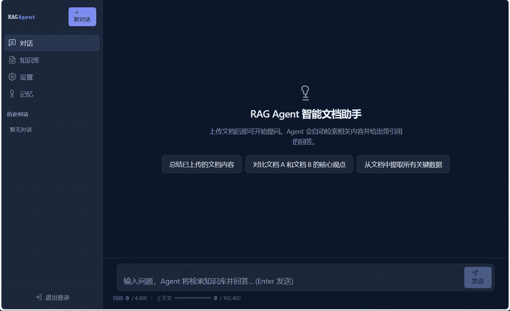
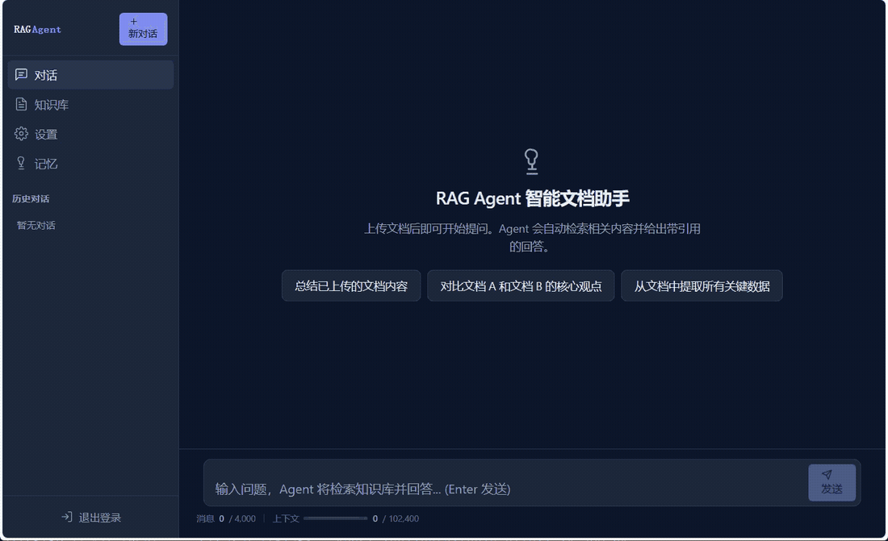
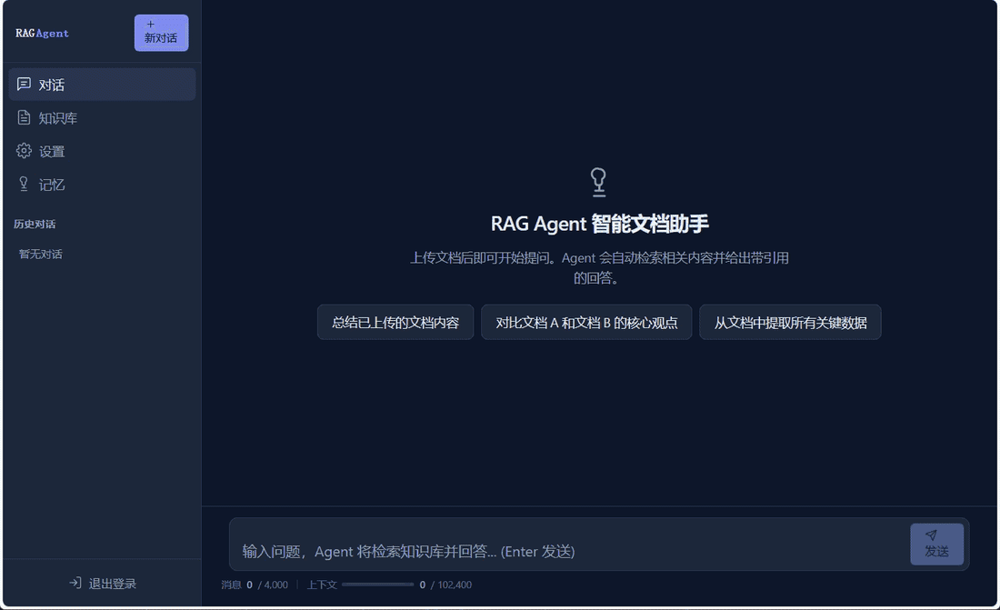
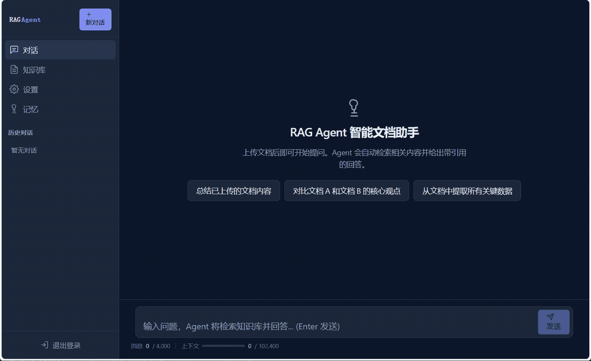
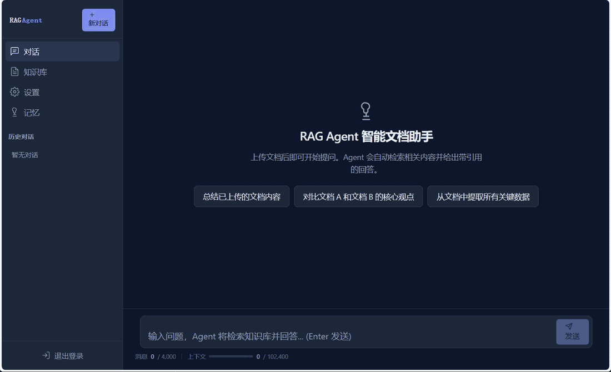

# RAG Agent 产品演示指南

本页提供五组可复现的产品演示。演示只展示当前仓库中已经存在的能力，所用组织、产品和参数均为公开合成数据。

## 五组完整演示

### 1. 文档列表工具

> 请列出当前知识库中的文档，并说明哪些文档包含产品规格、价格、运维步骤和 SLA。

重点观察：Agent 先调用 `list_documents` 获取完整清单，再通过 `search_docs` 确认产品规格、价格、运维步骤和 SLA 的正文归属。

### 2. 单文档精确检索

> XG-7 Standard 和 Pro 的节点上限、持续事件吞吐、本地缓存分别是多少？什么情况下 75 节点项目仍应选 Pro？请逐项引用来源。

重点观察：回答逐项给出型号参数和选型条件，每项使用行内引用，并展示 Markdown 产品指南来源卡片。

### 3. 跨文档检索与计算器

> 客户需要 1 台 XG-7 Pro、75 个激活节点、1 年平台订阅和标准实施服务。请计算未税首年总预算，列出硬件、订阅原价、年付折扣、实施费和最终总额；必须使用知识库价格并展示计算过程和引用。

重点观察：`search_docs` 与 `calculator` 的调用过程、价格表行内引用以及 Excel 来源卡片。正确结果为订阅原价 30,480 元、年付折扣 3,048 元、折后订阅 27,432 元、未税首年总预算 43,032 元。

### 4. 跨 Word 与 PDF 的条件判断

> 周三 03:00 发生 E-417 并造成服务中断。请说明现场工程师应该怎么恢复；这段中断是否必然计入 SLA 可用性？请结合运维手册和 SLA 中的条件回答并引用来源。

重点观察：Agent 同时使用 Word 运维手册和 PDF SLA。03:00 虽处于常规维护窗口，但不能仅凭发生时间判断是否排除；还要检查提前通知、公告范围和实际中断范围等全部条件。

### 5. 无答案拒答

> XG-7 通过了哪一级等保测评？它的 ISO 27001 证书编号和数据跨境备案号分别是什么？

重点观察：知识库没有对应信息时，Agent 明确说明无法确认，不编造等级或证书编号。
