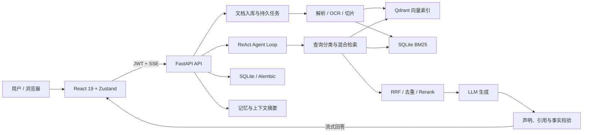

# RAG Agent：可验证、可恢复、可扩展的本地知识库智能体

> 项目阶段：`v0.1.0-beta` 开源候选  
> 核心定位：将本地文档转化为可检索、可引用、可验证的智能问答知识库。


## 一句话介绍

RAG Agent 是一个面向真实文档场景的开源 RAG 系统。它不仅能“搜到内容并回答”，还围绕文档入库、混合检索、证据引用、事实校验、长上下文、后台任务恢复、权限认证和工程化评测建立了完整闭环。

项目适合个人知识库、团队内部资料问答、产品与技术文档助手、研究资料整理、制度/手册检索以及需要引用溯源的专业问答场景。

## 核心数据一览

| 维度 | 当前结果 | 说明 |
|---|---:|---|
| 回答忠实度 | **98.48%** | 回答中的事实声明可由证据支持 |
| 引用精确率 | **98.48%** | 引用来源能够支持对应声明 |
| 引用召回率 | **98.48%** | 需要引用的声明获得有效引用 |
| 拒答准确率 | **100.00%** | 无充分证据时正确拒答 |
| 回答完成度 | **98.92%** | 对可回答问题提供完整结果 |
| 预期事实召回 | **87.47%** | 预先标注的关键事实被回答覆盖 |
| 检索 Recall@10 | **99.57%** | 严格 qrels 检索集 |
| 检索 Hit@3 | **100.00%** | 前 3 条结果至少命中一条相关证据 |
| 检索 MRR | **97.70%** | 首条相关结果排名表现 |
| 后端代码覆盖率 | **72%** | 10,172 个可执行语句，含分支覆盖统计 |
| 前端测试通过率 | **100%** | 64 / 64 Vitest 测试通过 |

> 指标来自仓库内可复现报告，不是人工估计值。完整口径见本文“测试与评测证据”。

## 为什么值得关注

### 1. 从“相似度搜索”升级为混合证据检索

系统同时使用 Qdrant 语义检索和 SQLite BM25 关键词检索，并通过加权 RRF 融合结果。它会识别错误码、SKU、型号、数值、货币、时间和实体名等强消歧信号，针对精确代码与自然语言问题采用不同权重。

- 精确术语由 BM25 保证命中能力；
- 自然语言由向量检索覆盖语义表达差异；
- RRF 融合避免单一路径主导结果；
- 内容去重和质量过滤减少重复、稀疏及噪声片段；
- Cross-Encoder Reranker 可选启用，未就绪时自动回退，不阻塞核心服务。

### 2. 回答不是“生成完就结束”，而是经过证据校验

RAG Agent 在生成阶段维护声明与来源的对应关系，并提供确定性修复和有界 LLM 修复：

- 检查引用是否存在、位置是否正确；
- 检查声明中的数字是否与证据一致；
- 为高置信度、唯一匹配的声明自动补充引用；
- 对无证据或证据不足的问题执行选择性拒答；
- 修复过程有超时、次数和接受条件，不会无限重试。

在 93 条受控在线问答中，质量门禁和性能门禁均通过，运行错误数为 **0**。

### 3. 面向长会话，而不是简单拼接历史消息

系统将系统提示、工具定义、工具参数、历史消息、工具结果和回答预留统一纳入 token 预算：

- 工具调用与工具结果按原子组裁剪，避免形成非法消息链；
- 优先保留系统提示与最近用户问题；
- 超长工具结果先按 tokenizer 安全截断；
- 被裁剪的历史生成有界摘要并持久化；
- 摘要带来源指纹和水位，避免重复归纳及并发覆盖。

### 4. 文档处理具备真实工程闭环

支持 PDF、DOCX、TXT、Markdown、CSV 和 XLSX：

- 流式上传与容量限制，避免大文件一次性进入内存；
- SHA-256 内容去重；
- 段落优先、表格保护的 tokenizer 感知切片；
- Qdrant 向量索引与 SQLite BM25 索引双写；
- 持久任务、心跳、重试、恢复与死信状态；
- OCR 未就绪时进入等待状态，模型可用后自动恢复处理；
- 删除、重建、备份和恢复覆盖文件、数据库与索引一致性。

### 5. 默认具备安全认证与本地数据边界

- JWT Bearer 保护业务 API；
- Refresh Token 仅存放于 `HttpOnly + SameSite=Lax` Cookie；
- 密码修改后旧 Refresh Token 自动失效；
- 支持角色与系统管理员权限校验；
- API Key 可使用 AES-256 加密保存；
- 默认绑定 `127.0.0.1`，远程访问需要显式开启；
- 上传文件、SQLite、Qdrant、BM25 和模型缓存默认保留在本地。

## 系统架构



## 主要功能

| 模块 | 能力 |
|---|---|
| 知识库 | 文档上传、批量上传、重复检测、状态追踪、删除与重建 |
| 检索 | Qdrant + BM25、查询分类、消歧、查询改写、RRF、去重、精排 |
| Agent | ReAct 工具循环、并行工具调用、重试、超时、降级与取消传播 |
| 回答 | SSE 流式输出、来源展示、引用校验、事实覆盖、选择性拒答 |
| 上下文 | Token 预算、原子消息裁剪、持久摘要、上下文溢出恢复 |
| 记忆 | 用户画像、会话记忆提取、三级去重与召回 |
| 文档处理 | PDF/DOCX/TXT/MD/CSV/XLSX，支持可选 OCR |
| 数据可靠性 | Alembic 迁移、迁移前快照、备份恢复、Revision Gate |
| 可观测性 | 健康检查、依赖状态、Prometheus 指标、审计日志、任务状态 |
| 安全 | JWT、HttpOnly Cookie、RBAC 基础、限流、加密配置、路径防护 |
| 部署 | 本地统一启动器、Docker Compose、GitHub Actions、发布门禁 |

## 测试与评测证据

### 在线回答质量评测

报告：[`grounded_answer_eval_final_full_rescored.json`](../backend/tests/grounded_answer_eval_final_full_rescored.json)

| 项目 | 参数 / 结果 |
|---|---:|
| 评测范围 | production-like controlled online |
| 数据集 | `rag-agent-eval-v2` / `2.0` |
| 完成问题 | 93 |
| 可回答问题 | 66（70.97%） |
| 不可回答问题 | 27（29.03%） |
| 模型调用 | 191 / 200 |
| 忠实度 | **98.48%** |
| 引用精确率 | **98.48%** |
| 引用召回率 | **98.48%** |
| 拒答准确率 | **100.00%** |
| 预期事实召回 | **87.47%** |
| 回答完成度 | **98.92%** |
| 平均总延迟 | **1,197.48 ms** |
| 总延迟 P95 | **2,109.26 ms** |
| 首 Token 延迟 P95 | **945.39 ms** |
| 运行错误 | **0** |
| 质量门禁 | **通过，0 项违规** |
| 性能门禁 | **通过，0 项违规** |

与不强制引用的控制组相比：

| 指标 | 控制组 | 优化组 | 提升 |
|---|---:|---:|---:|
| 忠实度 | 86.68% | **98.48%** | **+11.81 pp** |
| 拒答准确率 | 74.07% | **100.00%** | **+25.93 pp** |
| 预期事实召回 | 84.67% | **87.47%** | **+2.81 pp** |
| 回答完成度 | 87.10% | **98.92%** | **+11.83 pp** |
| 平均总延迟 | 1,169.91 ms | 1,197.48 ms | +2.36% |

这组结果表明：在平均延迟增加约 **2.36%** 的情况下，系统显著提升了回答忠实度、完成度和拒答准确率。

### 严格 qrels 检索评测

报告：[`evaluation_results_complex_v2.json`](../backend/tests/evaluation_results_complex_v2.json)

评测使用 29 条复杂、混淆和跨文档查询，`qrels_fallback_count=0`，即全部查询均使用显式相关性标注，而非运行结果自动生成的 ground truth。

| 指标 | Top-3 | Top-5 | Top-10 |
|---|---:|---:|---:|
| Recall | **88.65%** | **92.96%** | **99.57%** |
| Hit Rate | **100.00%** | **100.00%** | **100.00%** |
| NDCG | **92.80%** | **93.17%** | **95.13%** |

| 排名指标 | 结果 |
|---|---:|
| MRR | **97.70%** |

评测参数：

| 参数 | 值 |
|---|---|
| Embedding | Qwen `text-embedding-v2` |
| 向量维度 | 1536 |
| Chunk Size / Overlap | 200 / 40 |
| Retrieval Top-K | 10 |
| Rerank Top-N | 24 |
| RRF K | 30 |
| 语义 / 关键词权重 | 2.0 / 1.0 |
| OCR | 开启 |

### 自动化测试与覆盖率

本地验证时间：2026-07-23。

| 测试项 | 结果 |
|---|---:|
| 后端测试收集规模 | **946 项** |
| 离线测试选择 | 931 项 |
| 后端通过 | **920 项** |
| 后端跳过 | 11 项 |
| 真实模型与 Docker 标记排除 | 15 项 |
| 已实际执行测试通过率 | **100.00%**（920 / 920） |
| 后端代码覆盖率 | **72%** |
| 前端 Vitest | **64 / 64，100%** |
| 前端 Oxlint | **通过** |
| 前端 TypeScript + Vite 构建 | **通过** |
| Python 基础依赖审计 | **0 个已知漏洞** |
| npm 生产依赖审计 | **0 个已知漏洞** |
| Docker E2E | **12 / 12 阶段通过** |
| Docker 严格冒烟测试 | **5 / 5 通过** |

离线测试主动排除了需要真实 LLM、Embedding 或运行中 Docker 环境的用例。Docker E2E 使用两份合成文档完成了真实入库、检索、两条 SSE 引用问答、重启持久化、备份恢复与 Qdrant 降级恢复。

> “100% 已执行测试通过率”“72% 代码覆盖率”和 RAG 质量百分比是三种不同口径：前者反映本次离线选择集的执行结果，覆盖率反映代码被测试触达的范围，RAG 指标反映检索与回答质量，不能互相替代。

## 可靠性设计

- **可选依赖不拖垮核心服务**：OCR 与 Reranker 可后台加载、失败降级并显示状态；
- **双检索路径降级**：语义或关键词路径单独失败时，另一条路径仍可提供结果；
- **持久任务恢复**：任务包含 payload、attempt、heartbeat、retry time 和 dead-letter；
- **迁移保护**：数据库自动迁移前创建快照，失败可恢复，拒绝盲目 stamp 未知数据库；
- **恢复一致性**：备份包校验成员、路径、容量、Schema Revision 和内容哈希；
- **流式连接治理**：支持客户端断连取消、SSE 心跳与阶段超时；
- **发布门禁**：质量报告绑定数据集、评测器、校验器和提示词 SHA-256，过期或指纹不一致即拒绝发布。

## 技术栈

| 层级 | 技术 |
|---|---|
| 后端 | Python 3.12、FastAPI、Pydantic、SQLAlchemy、Alembic |
| 前端 | React 19、TypeScript、Vite、Zustand、React Router |
| 向量检索 | Qdrant |
| 关键词检索 | SQLite BM25 / FTS |
| LLM 与 Embedding | OpenAI-compatible API，可配置不同供应商 |
| 文档解析 | PDF、DOCX、TXT、Markdown、CSV、XLSX，可选 OCR |
| 精排 | sentence-transformers Cross-Encoder（可选） |
| 测试 | Pytest、pytest-asyncio、pytest-cov、Vitest、Testing Library、Playwright |
| 工程化 | Docker Compose、GitHub Actions、Prometheus、结构化日志 |

## 快速开始

### Docker Compose

```bash
git clone <repository-url>
cd RAG_Agent
cp backend/.env.example backend/.env
```

至少配置：

```env
JWT_SECRET=<固定的至少 32 字符随机值>
BOOTSTRAP_ADMIN_PASSWORD=<首次启动管理员密码>
```

然后启动：

```bash
docker compose --env-file backend/.env up -d
```

- Web：<http://localhost:5173>
- API：<http://localhost:8000>
- OpenAPI：<http://localhost:8000/docs>

### 本地开发

```bash
python -m venv .venv
# Windows
.venv\Scripts\activate
pip install -r backend/requirements.txt -r backend/requirements-dev.txt

cd frontend
npm install
cd ..
python main.py
```

## 适用场景

- 企业制度、SOP、产品手册和技术文档问答；
- 项目资料、会议纪要和研究报告检索；
- 错误码、型号、接口字段和配置项精确查询；
- 多文档对比、事实抽取和带来源总结；
- 对数据本地保存、引用溯源和回答可信度有要求的知识助手。

## 项目边界

- 当前定位是单实例、本地优先的开源候选，不等同于完整 SaaS 多租户平台；
- 公网部署需要 HTTPS、反向代理、防火墙、强密钥以及 `AUTH_COOKIE_SECURE=true`；
- 在线评测结果与模型、数据集、提示词和网络环境相关，升级任一环节后应重新生成报告；
- OCR、Reranker、真实 LLM 和 Embedding 的可用性取决于本地依赖、模型缓存和外部供应商；
- 百分比指标应连同样本规模、评测参数和 provenance 一并解读。

## 进一步了解

- [README](../README.md)：安装、配置与使用入口；
- [项目参考](PROJECT_REFERENCE.md)：架构、配置、运维、安全边界和故障排查；
- [贡献指南](../CONTRIBUTING.md)：开发环境、测试和提交规范；
- [MIT License](../LICENSE)：开源许可证。

---

RAG Agent 的优势不是堆叠功能数量，而是把“文档进入系统”到“答案有证据、过程可恢复、结果可评测”做成了一条完整且可验证的工程链路。
